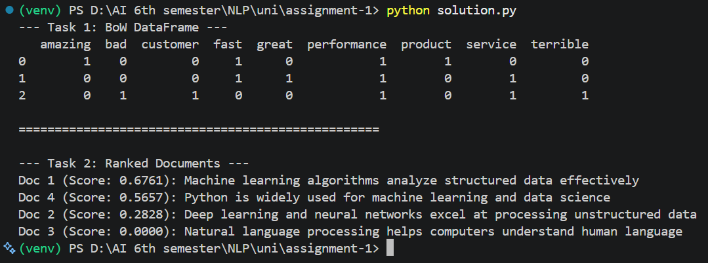

# NLP Assignment 1

## Output

---

## Answer of Question No. 01

**Word Order Invariance:** The Bag of Words model ignores syntax and word order, counting only raw frequencies. Therefore, "Dog bites man" and "Man bites dog" yield identical vector representations, destroying contextual sentiment since word sequence dictates emotional polarity.

## Answer of Question No. 02

**Matrix Sparsity Issue:** A 100,000-word vocabulary creates an enormous matrix where almost all entry counts are zero. This extreme sparsity causes high memory consumption and demands sparse matrix optimization structures.

## Answer of Question No. 03

**Zero Similarity Score:** Document 3 ("Natural language processing helps computers understand human language") receives a score of 0.0000 because it shares zero overlapping vocabulary terms with the query terms (machine, learning, algorithms, data).